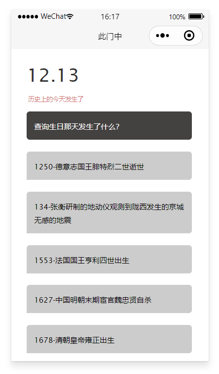
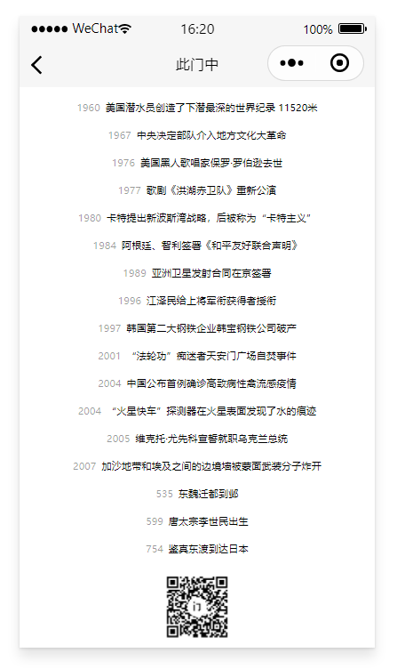

# inside-door-wechat-miniprogram
去年今日小程序, 含数据库文件，可快速部署




## 如何使用
```bash
git clone https://github.com/h53/inside-door-wechat-miniprogram.git
```
* 用微信开发者工具打开，修改 `project.config.json` 中的 `appid`
* 将 `cloudfunctions/index.js` 中 `env` 修改为自己的云主机环境 id
* 在云开发控制台添加 `history` 集合，并导入 `database` 文件夹下的 json 文件
* 创建并部署 `cloudfunctions`
* 编译  

*ps：也可以直接请求 [这里](https://github.com/h53/inside-door-restful-api) 的接口*


